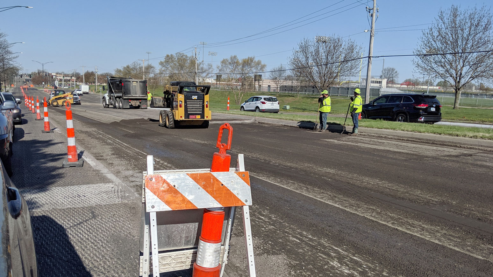

# GCP Vision AI Test

Tutorial used to make this project: https://cloud.google.com/vision/docs/quickstart-client-libraries

## Navigating the Virtual Environment

Entering: `$ source env/bin/activate`

Exiting: `$ deactivate`

## Output for each image

### catcafe.jpg


Output:

```
Labels:
Cat
Floor
Interior design
Room
Furniture
Living room
Flooring
Table
Felidae
Small to medium-sized cats
```

### desk.jpg


Output:

```
Labels:
Laptop
Personal computer
Netbook
Electronic device
Technology
Computer keyboard
Computer
Desk
Computer monitor
Space bar
```

### streetconstruction.jpg



Output:

```
Labels:
Asphalt
Lane
Road
Road surface
Transport
Traffic
Vehicle
Line
Street
Infrastructure
```
